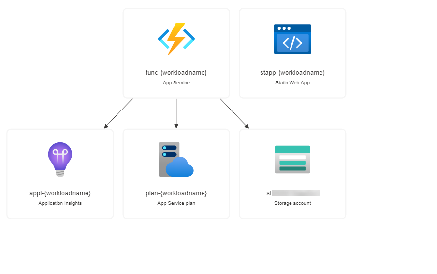

# 1-1	Nuxt.js で SPA をサーバーレス環境にデプロイしたい

Nuxt.js を使用してシングルページアプリケーション (SPA) をサーバーレス環境にデプロイしたい際の構成例です。

静的コンテンツホスティングに最適化された環境である Azure Static Web Apps を使用することで CI/CD 環境からステージング、本番環境まで一括で展開することができます。


## 構成


### Azure リソース構成

- フロントエンド
  - Azure Static Web Apps
- バックエンド
  - Azure Functions
  - Azure App Service
  - Azure Storage Account




## 利用方法

下記の「Deploy to Azure」ボタンから開くと、Azure ポータルのデプロイ用のパラメータ入力画面に遷移します。

[](https://portal.azure.com/#create/Microsoft.Template/uri/https%3A%2F%2Fraw.githubusercontent.com%2Fquickstart-templates%2FAzure-for-startups%2Fmain%2F1_web-application%2F1-1_spa-on-serverless%2Fazuredeploy.json)


下記の情報を入力して「Review + create」ボタンを選択し、パラメータの検証が正常に完了したら、「Create」ボタンを選択してデプロイを実行します。


| 項目 | 説明 |
|----|----|
| Project details | |
| Subscription | 利用するサブスクリプションを選択 |
| Resource Group | 利用する既存のグループを選択、または「Create new」から新規作成 |
| Instance details | |
| Region | 利用するリージョンを選択 |
| Workload Name | リソース名に付与する識別用の文字列（プロジェクト名など）を入力 |
| App Service Plan Sku Name | Azure App Service Plan の SKU を選択 |
| Storage Account Sku Name | Azure Functions に利用する Azure Storage Account の SKU を選択 |
| Static App Location | Azure Static Web App の API におけるリージョン（※1）を選択 |
| Static App Config App Location | Azure Static Web App のビルド構成（※2）の `app_location` を入力（デフォルトは Nuxt.js 3 の場合の例） |
| Static App Config App Output Location | Azure Static Web App のビルド構成（※2）の `output_location` を入力（デフォルトは Nuxt.js 3 の場合の例） |
| Static App Config App Build Command | Azure Static Web App のビルド構成（※2）の `app_build_command` を入力（デフォルトは Nuxt.js 3 の場合の例） |
| Static App Github Repository Url | Azure Static Web App にデプロイするコードを含む GitHub リポジトリのURLを指定（例: `https://github.com/{owner}/{repository}`） |
| Static App Github Repository Branch | Azure Static Web App にデプロイするブランチを指定 |
| Static App Skip GitHub Action Workflow Generation | 指定したソースリポジトリに対する GitHub Actions のワークフローファイルの生成をスキップするかどうかを選択（生成する場合は `false`, 生成しない場合は `true`）（※3） |
| Static App Github Access Token | GitHub personal Access token （スコープ `repo`, `workflow`）を入力。GitHub Action ワークフローを作成する場合に必要（※4） |

- ※1 Azure Static Web App の API におけるリージョンは、内蔵型の API を利用する際に展開する先を指します。本テンプレートの構成では、外部 API を利用するのでリージョンの指定は無効となりますが、必須項目のため設定します。
- ※2 Azure Static Web App のビルド構成については、[Azure Static Web Apps のビルド構成 | Microsoft Docs](https://docs.microsoft.com/ja-jp/azure/static-web-apps/build-configuration) をご参照ください。
- ※3 GitHub Actions のワークフロー生成をスキップすると、コードのデプロイは行われません。GitHub personal access token も不要です。
- ※4 GitHub Personal access token については、[個人アクセストークンを使用する - GitHub Docs](https://docs.github.com/ja/authentication/keeping-your-account-and-data-secure/creating-a-personal-access-token) をご参照ください。スコープは `repo`, `workflow` が必要です。


### 備考

- Azure リソースの命名規則については、[名前付け規則を定義する - Cloud Adoption Framework | Microsoft Docs](https://docs.microsoft.com/ja-jp/azure/cloud-adoption-framework/ready/azure-best-practices/resource-naming) も併せてご参考ください。


## デバッグ

本テンプレートをデバッグする場合は、ご参考ください。


### Azure CLI によるデプロイ

```bash
WORKLOAD_NAME="{string to identify your resources}"
RESOURCE_GROUP_NAME="rg-${WORKLOAD_NAME}"
LOCATION="{location that resources are deploy}"
az group create --name ${RESOURCE_GROUP_NAME} --location ${LOCATION}
az deployment group create --resource-group ${RESOURCE_GROUP_NAME} --template-file bicep/azuredeploy.bicep
```


### Bicep によるARMテンプレート生成

```bash
az bicep build --file bicep/azuredeploy.bicep --outdir .
```


## 参考

- [チュートリアル: ARM テンプレートを使用して Azure 静的 Web アプリを発行する | Microsoft Docs](https://docs.microsoft.com/ja-jp/azure/static-web-apps/publish-azure-resource-manager?tabs=azure-cli)