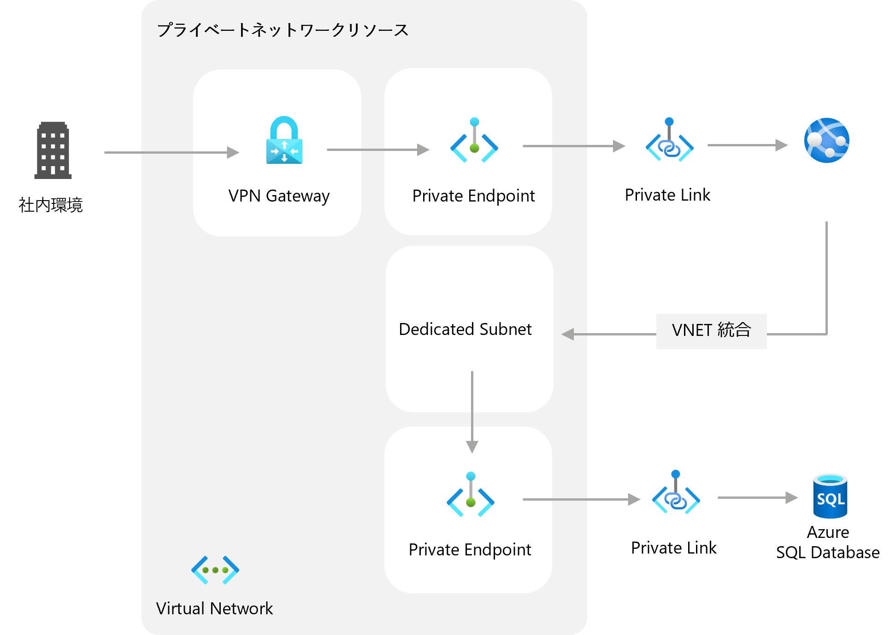
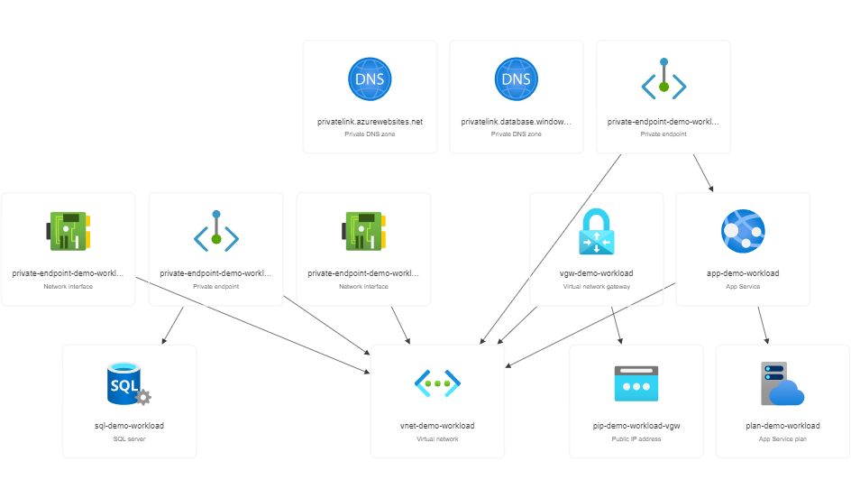
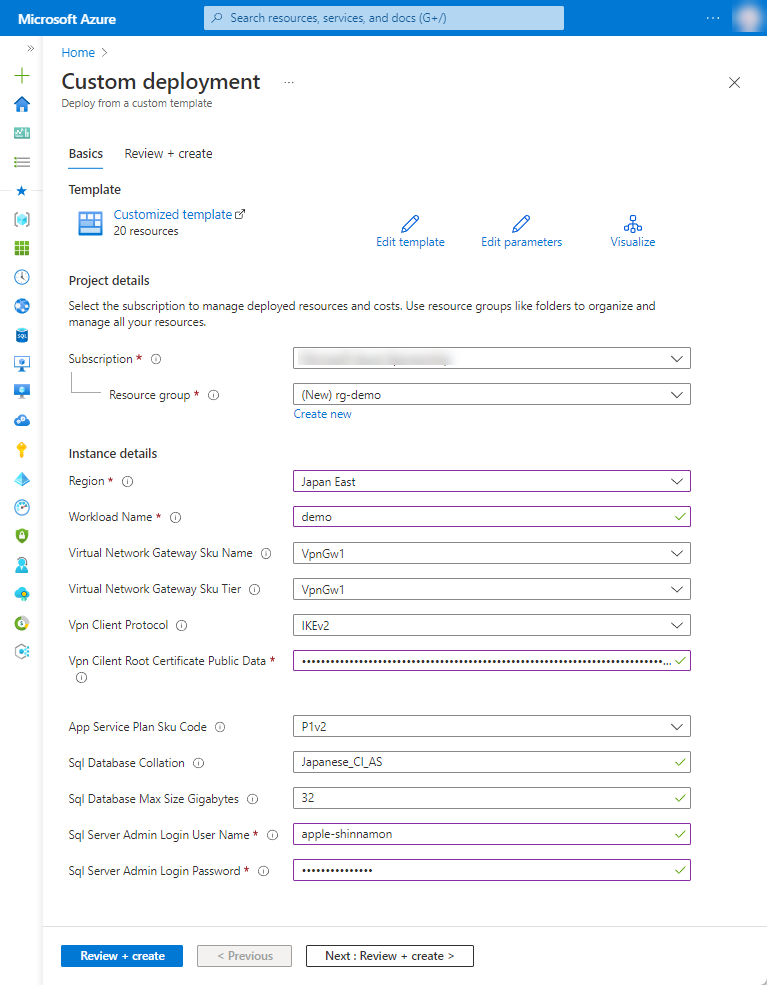
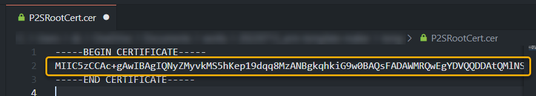
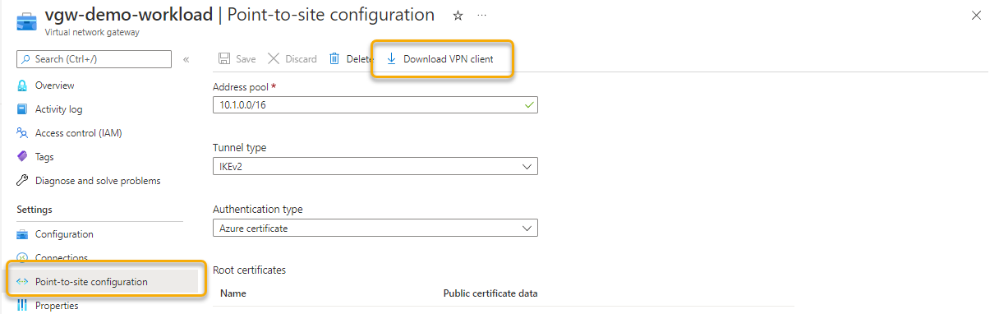
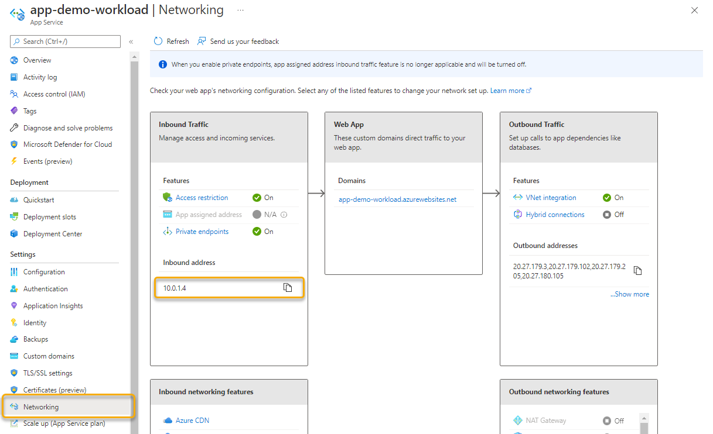
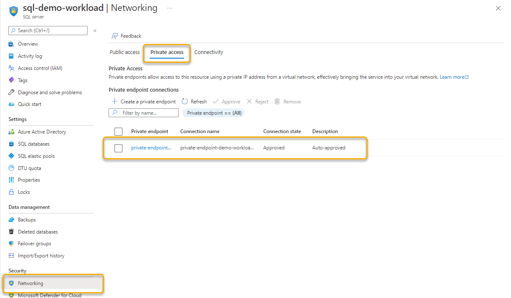
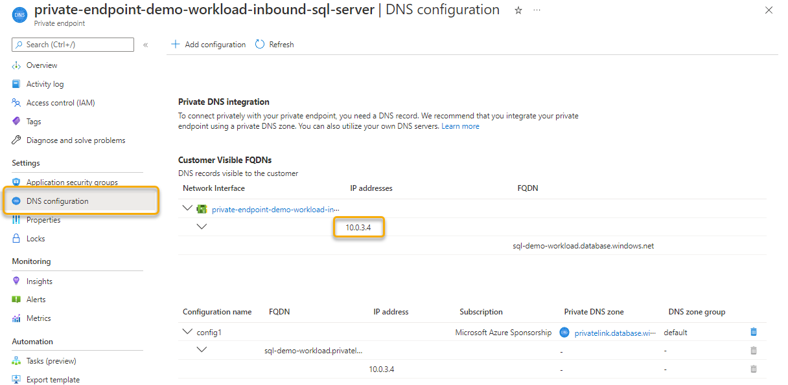

# 1-3 プライベート通信のみのシステムを Full PaaS で実現したい

プライベート通信のみしか許可されないセキュリティ要件の高い Web システムをフル PaaS 構成で実現したい際の構成例です。

Azure Private Endpoint を使用することで、PaaS 製品のエンドポイントに Private IP を提供できます。また、Azure App Service の VNET 統合により、アプリのバックエンドを指定したネットワークに集約できます。


## 構成




### Azure リソース構成

- Azure VPN Gateway
- Azure Virtual Network
- Azure Private DNS zone
- Azure Private Endpoint
- Azure App Service (Web app)
- Azure SQL Server/Database




## 利用方法

### 事前準備

本構成では、証明書認証を利用したポイント対サイト構成を用いているため、**ルート証明書** および **クライアント証明書** が必要です。ルート証明書は、エンタープライズ 証明機関によって発行された証明書（推奨）、または自己署名証明書を利用できます。こちらを参考にご用意ください。

- [ルート証明書を生成する](https://docs.microsoft.com/ja-jp/azure/vpn-gateway/vpn-gateway-howto-point-to-site-resource-manager-portal#getcer)
- [クライアント証明書を生成する](https://docs.microsoft.com/ja-jp/azure/vpn-gateway/vpn-gateway-howto-point-to-site-resource-manager-portal#generateclientcert)

上記の手順により、作業したマシンにクライアント証明書がインストールした状態となっているはずですが、別途インストールする場合はこちらをご参考ください。

- [ポイント対サイトのクライアント証明書のインストール - Azure VPN Gateway | Microsoft Docs](https://docs.microsoft.com/ja-jp/azure/vpn-gateway/point-to-site-how-to-vpn-client-install-azure-cert)


### リソースのデプロイ

下記の「Deploy to Azure」ボタンから開くと、Azure ポータルのデプロイ用のパラメータ入力画面に遷移します。

[](https://portal.azure.com/#create/Microsoft.Template/uri/https%3A%2F%2Fraw.githubusercontent.com%2Fquickstart-templates%2FAzure-for-startups%2Fmain%2F1_web-application%2F1-3_full-paas-via-private-communication%2Fazuredeploy.json)

各入力欄に適宜入力し、「Review + create」ボタンを選択します。パラメータの検証が正常に完了したら、「Create」ボタンを選択してデプロイを実行します。



| 項目 | 説明 |
|----|----|
| Project details | |
| Subscription | 利用するサブスクリプションを選択 |
| Resource Group | 利用する既存のグループを選択、または「Create new」から新規作成 |
| Instance details | |
| Region | 利用するリージョンを選択 |
| Workload Name | リソース名に付与する識別用の文字列（プロジェクト名など）を入力 |
| Virtual Network Gateway Sku Name | VPN ゲートウェイの SKU を選択（※1） |
| Virtual Network Gateway Sku Tier | VPN ゲートウェイの Tier を選択（Virtual Network Gateway Sku Name と同じ項目を選択してください） |
| Vpn Client Protocol | VPN ゲートウェイで使用するクライアントプロトコルを選択（※2） |
| Vpn Client Root Certificate Public Data | base64エンコードされたルート証明書の内容を入力（※3） |
| App Service Plan Sku Name | Azure App Service Plan の SKU を選択 |
| Sql Database Collation | Azure SQL Database の照合順序を選択（※4） |
| Sql Database Max Size Gigabyes | Azure SQL Database の最大サイズを入力（GB） |
| Sql Server Admin Login User Name | Azure SQL Server の管理者ユーザー名を入力 |
| Sql Server Admin Login Password | Azure SQL Server の管理者ユーザーのパスワードを入力（※5） |

※1 VPN ゲートウェイの SKU については、トンネルの数や種類、スループットによって異なります。詳細はこちらをご参照ください。

- [Gateway の SKU](https://docs.microsoft.com/ja-jp/azure/vpn-gateway/vpn-gateway-about-vpngateways#gwsku)

※2 VPN ゲートウェイのクライアントプロトコル（トンネルの種類）については、接続するクライアントの OS などによって異なります。詳細はこちらをご参照ください。

- [トンネルの種類と認証の種類を指定する](https://docs.microsoft.com/ja-jp/azure/vpn-gateway/vpn-gateway-howto-point-to-site-resource-manager-portal#type)

※3 前項で生成したルート証明書 _P2SRootCert.cer_ は、ファイルを開くと base64 でエンコードされた値を含みます。その値（`-----BEGIN CERTIFICATE-----` と `-----END CERTIFICATE-----` を除く）を「Vpn Client Root Certtificate Public Data」として入力します。このとき、**改行などの制御文字が入らないようご注意** ください。詳しくは、[ルート証明書の公開キー情報をアップロードする](https://docs.microsoft.com/ja-jp/azure/vpn-gateway/vpn-gateway-howto-point-to-site-resource-manager-portal#uploadfile) をご参照ください。



※4 Azure SQL Server の照合順序については、こちらをご参照ください。

- [照合順序と Unicode のサポート - SQL Server | Microsoft Docs](https://docs.microsoft.com/ja-jp/sql/relational-databases/collations/collation-and-unicode-support?view=sql-server-ver16)

※5 Azure SQL Server のパスワードについては、SQL Server のパスワードポリシーに従う必要があります。英数字記号を含む8文字以上の文字列を入力してください。詳細はこちらをご参照ください。

- [パスワード ポリシー - SQL Server | Microsoft Docs](https://docs.microsoft.com/ja-jp/sql/relational-databases/security/password-policy?view=sql-server-ver16)


## リソース配置後の作業

### VPN ゲートウェイに接続する

VPN ゲートウェイに接続するには、VPNゲートウェイ（Virtual network gateway） の Point-to-site configuration からダウンロードできる VPN client を利用すると便利です。



詳しくは、こちらをご参照ください。

- [Azure に接続する](https://docs.microsoft.com/ja-jp/azure/vpn-gateway/vpn-gateway-howto-point-to-site-resource-manager-portal#connect)

### 手元のマシンの hosts 書換え

VPN で接続すると、作成したリソースにプライベートIPで接続できるようになります。このとき、ドメインの名前解決はグローバルに探しに行ってしまうため、接続するマシンで解決できるよう対応する必要があります。ここでは _hosts_ ファイルにおける対応について紹介します。

_hosts_ ファイルは、Windows は `C://Windows/System32/drivers/etc/hosts`、Mac は `/etc/hosts` にあります。このファイルに、作成したリソースのプライベートIPとドメイン名を対応付けて記載します。

下記は、「Workload Name」を `demo` とした場合の例です。

```
10.0.1.4 app-demo.azurewebsites.net
10.0.3.4 sql-demo.database.windows.net
```

実際のプライベートIPアドレス、およびドメイン名は、生成されたリソースの情報をご確認ください。ドメイン名（URL）は、各リソースの Overview（概要）ページに記載されています。

Web app プライベートIPアドレスは、 Networking ページから確認できます。



また、SQL Server のプライベートIPアドレスは、 Networking > Priveate acces から Private endpoint のページに移動し DNS configuration をご確認ください。





## デバッグ

本テンプレートをデバッグする場合は、ご参考ください。


### Azure CLI によるデプロイ

```bash
WORKLOAD_NAME="{string to identify your resources}"
RESOURCE_GROUP_NAME="rg-${WORKLOAD_NAME}"
LOCATION="{location that resources are deploy}"
az group create --name ${RESOURCE_GROUP_NAME} --location ${LOCATION}
az deployment group create --resource-group ${RESOURCE_GROUP_NAME} --template-file bicep/azuredeploy.bicep
```


### Bicep によるARMテンプレート生成

```bash
az bicep build --file bicep/azuredeploy.bicep --outdir .
```

## 参考

- [azure-quickstart-templates/quickstarts/microsoft.sql/private-endpoint-sql at master · Azure/azure-quickstart-templates](https://github.com/Azure/azure-quickstart-templates/tree/master/quickstarts/microsoft.sql/private-endpoint-sql)
- [P2S VPN と証明書認証を使用して VNet に接続する: ポータル - Azure VPN Gateway | Microsoft Docs](https://docs.microsoft.com/ja-jp/azure/vpn-gateway/vpn-gateway-howto-point-to-site-resource-manager-portal)
