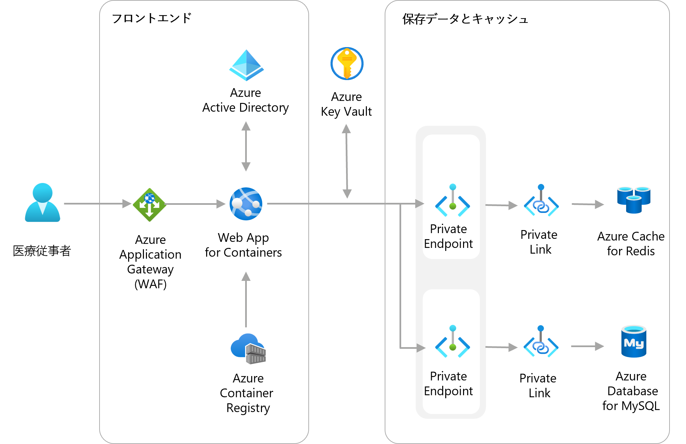

# 1-4 患者情報を入力できる簡易的な電子カルテサービスを実装したい

患者情報を入力できる簡易的な電子カルテサービスを実装したい際の構成例です。Web サーバーからデータベースまでフルマネージドなサービスの活用で実装できます。

Azure App Service はコンテナのデプロイにも対応しています。コンテナ化されたアプリを PaaS 環境でスケーラブルに実行することができます。


## 構成




### Azure リソース構成


## 利用方法

### 事前準備

- ユーザーの object ID の取得

```
az ad user list --output table
az ad user show --id {UserPrincipalName}
```

### リソースのデプロイ

下記の「Deploy to Azure」ボタンから開くと、Azure ポータルのデプロイ用のパラメータ入力画面に遷移します。

[](https://portal.azure.com/#create/Microsoft.Template/uri/https%3A%2F%2Fraw.githubusercontent.com%2Fquickstart-templates%2FAzure-for-startups%2Fmain%2F1_web-application%2F1-4_simple-electronic-medical-record%2Fazuredeploy.json)

各入力欄に適宜入力し、「Review + create」ボタンを選択します。パラメータの検証が正常に完了したら、「Create」ボタンを選択してデプロイを実行します。


| 項目 | 説明 |
|----|----|
| Project details | |
| Subscription | 利用するサブスクリプションを選択 |
| Resource Group | 利用する既存のグループを選択、または「Create new」から新規作成 |
| Instance details | |
| Region | 利用するリージョンを選択 |
| Workload Name | リソース名に付与する識別用の文字列（プロジェクト名など）を入力 |


key vault は、ネットワーク制限をしているため、ポータルからシークレットなどの変更ができません。アクセスする場合は IP許可するなどの疎通を行ってください。


## デバッグ

本テンプレートをデバッグする場合は、ご参考ください。


### Azure CLI によるデプロイ

```bash
WORKLOAD_NAME="{string to identify your resources}"
RESOURCE_GROUP_NAME="rg-${WORKLOAD_NAME}"
LOCATION="{location that resources are deploy}"
az group create --name ${RESOURCE_GROUP_NAME} --location ${LOCATION}
az deployment group create --resource-group ${RESOURCE_GROUP_NAME} --template-file bicep/azuredeploy.bicep
```


### Bicep によるARMテンプレート生成

```bash
az bicep build --file bicep/azuredeploy.bicep --outdir .
```


### App service の SCM から内部ネットワークの疎通確認を行う

本構成の Web App for container は、SSH接続できるイメージを利用しており、SCM 管理ツールのコンソールから操作が可能です。疎通確認の際は下記をご参考ください。

```bash
apt update
apt install traceroute stunnel redis-tools defualt-mysql-client

# ドメイン解決の確認
nslookup {host name}

# 接続ルートの確認
traceroute {host name}

# Redis の接続確認
vi /etc/stunnel/stunnel.conf  # 下記を参考に記述
service stunnel4 reload
service stunnel4 start
redis-cli -p 6380
127.0.0.1:6380> AUTH {Azure Cache for Redis key}

# MySQL の接続確認
MYSQL_HOST={Azure Database for MySQL name}.mysql.database.azure.com
MYSQL_HOST=mysql-debug-0914.mysql.database.azure.com
mysql -h $MYSQL_HOST -u {user name}@$MYSQL_HOST -p --ssl
Enter password: {password}
```

_/etc/stunnel/stunnel.conf_ の設定は下記のように記述します。
```
[redis-cli]
client = yes
accept = 127.0.0.1:6380
connect = {Azure Cache for Redis name}.redis.cache.windows.net:6380
```

`redis-cli` を用いた Azure Cache for Redis への接続は、下記もご参考ください。

```
- [Azure Cache for Redis での redis-cli の使用 | Microsoft Docs](https://docs.microsoft.com/ja-jp/azure/azure-cache-for-redis/cache-how-to-redis-cli-tool)