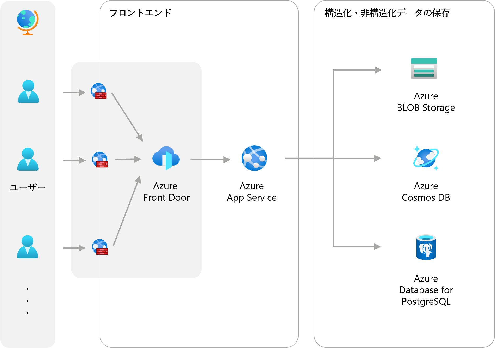
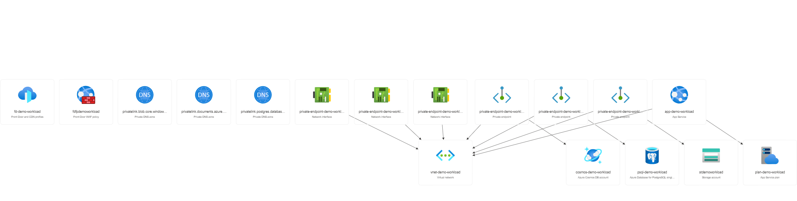
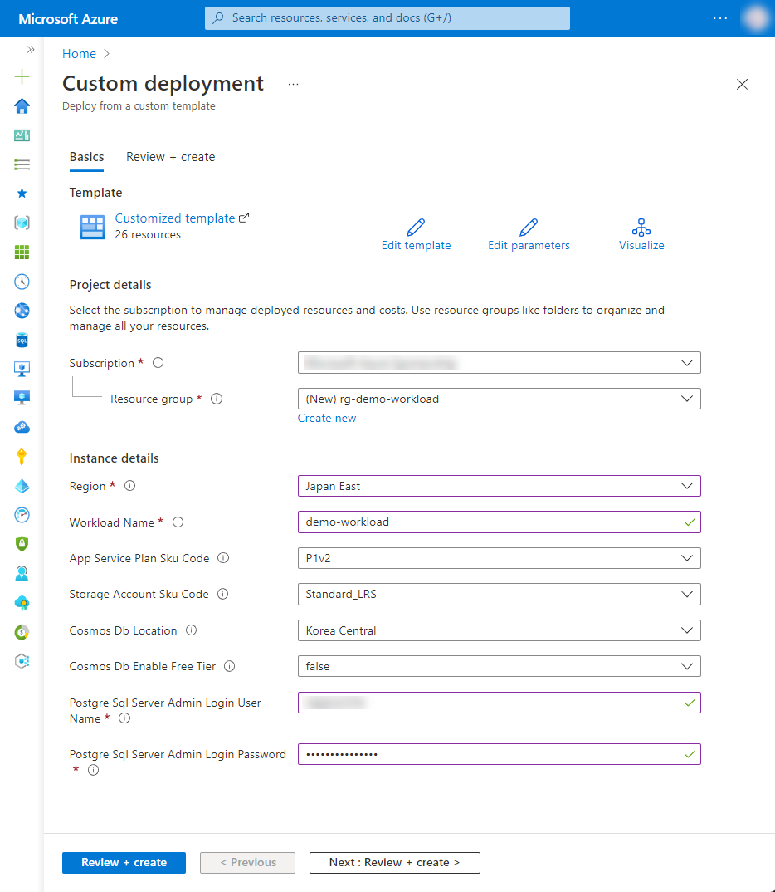

# 1-6 D2C ブランドの企画・生産・EC 販売を提供するサービスを作りたい

D2C ブランドの企画・生産・EC 販売までを一貫したサービスとして立ち上げたい際の構成例です。保存したいデータの種類や形式により、様々なストレージやデータベースが提供されています。

Azure Front Door を活用することにより WAF の機能の他、CDN が含まれているため、快適な顧客エクスペリエンスを提供できます。


## 構成




### Azure リソース構成

- Azure Front Door
- Azure Web Application Firewall
- Azure Web App
- Azure Blob Storage
- Azure Cosmos DB
- Azure Database for PostgreSQL




## 利用方法

### リソースのデプロイ

下記の「Deploy to Azure」ボタンから開くと、Azure ポータルのデプロイ用のパラメータ入力画面に遷移します。

[](https://portal.azure.com/#create/Microsoft.Template/uri/https%3A%2F%2Fraw.githubusercontent.com%2Fquickstart-templates%2FAzure-for-startups%2Fmain%2F1_web-application%2F1-6_integrated-platform-for-d2c-brand%2Fazuredeploy.json)

各入力欄に適宜入力し、「Review + create」ボタンを選択します。パラメータの検証が正常に完了したら、「Create」ボタンを選択してデプロイを実行します。



| 項目 | 説明 |
|----|----|
| Project details | |
| Subscription | 利用するサブスクリプションを選択 |
| Resource Group | 利用する既存のグループを選択、または「Create new」から新規作成 |
| Instance details | |
| Region | 利用するリージョンを選択 |
| Workload Name | リソース名に付与する識別用の文字列（プロジェクト名など）を入力 |
| App Service Plan Sku Code | Azure App Service Plan のプランを選択 |
| Storage Account Sku Code | Azure Storage Account の SKU を選択 |
| Cosmos Db Location | Azure Cosmos DB のリージョンを選択（※1） |
| Cosmos Db Enable Free Tier | Azure Cosmos DB の無料レベルを有効にするか選択 |
| Postgre Sql Server Admin Login User Name | Azure Database for PostgreSQL の管理者ユーザー名を入力 |
| Postgre Sql Server Admin Login Password | Azure Database for PostgreSQL の管理者パスワードを入力 |

※1  現在、Azure Cosmos DB のリージョンが制限されており、リソースグループとは別にリージョンを選択できるようにしています。利用可能なリージョンについては、別途 Azure ポータルで Cosmos DB の作成画面を開き、リージョンの選択肢からご確認ください。

## リソース配置後の作業

### FrontDoor - App Service 間の Private Endpoint を有効化する

FrontDoor から設定した Private Link 接続は、接続先の App Service で承認（approve）する必要があります。

Azure ポータルで操作する場合、App Service の「Network」>「Inbound Traffic」の「Private endpoints」を開くと、Private Endpoint connections の一覧に「Pending」と表示された connetion があるので、その行を選択し、上部メニューの「Approve」を選択します。

Azure CLI で操作する場合は、下記をご参考ください。

```bash
WORKLOAD_NAME="{string to identify your resources}"
RESOURCE_GROUP_NAME="rg-${WORKLOAD_NAME}"
APP_ID=$(az resource list --resource-group ${RESOURCE_GROUP_NAME} --resource-type Microsoft.Web/sites --query [0].id --output tsv)
PRIVATE_ENDPOINT_CONNECTION_ID=$(az network private-endpoint-connection list --id ${APP_ID} --query [0].id --output tsv)
az network private-endpoint-connection approve --id ${PRIVATE_ENDPOINT_CONNECTION_ID} --description "Approved"
```


## デバッグ

本テンプレートをデバッグする場合は、ご参考ください。


### Azure CLI によるデプロイ

```bash
WORKLOAD_NAME="{string to identify your resources}"
RESOURCE_GROUP_NAME="rg-${WORKLOAD_NAME}"
LOCATION="{location that resources are deploy}"
az group create --name ${RESOURCE_GROUP_NAME} --location ${LOCATION}
az deployment group create --resource-group ${RESOURCE_GROUP_NAME} --template-file bicep/azuredeploy.bicep
```


### Bicep によるARMテンプレート生成

```bash
az bicep build --file bicep/azuredeploy.bicep --outdir .
```