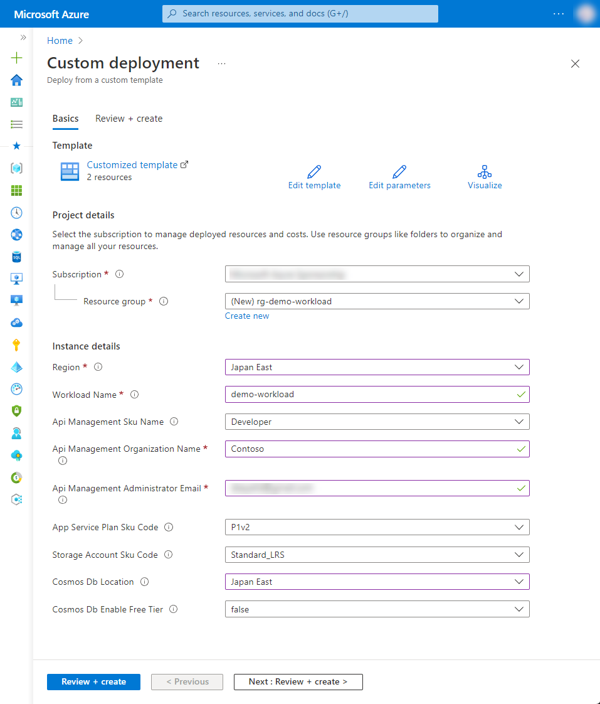

# 1-7 Flutter を使用して Web アプリを作りたい

Flutter を使用して作成した Web アプリを公開する際の構成例です。

静的コンテンツはストレージサービスである Azure Blob Storage にてホスト・公開できます。API によって取得された情報を分析基盤サービスと連携し、データの利活用を行うことも可能です。


## 構成


### Azure リソース構成

- 静的なコンテンツ
  - Azure CDN
  - Azure Blob Storage
- API
  - Azure API Management
  - Azure Functions
  - Azure Cosmos DB
  - Azure Virtual Network
  - Azure Private DNS zone
  - Azure Private Endpoint


なお、本構成の Azure Functions は、Node.js v16 で構成しています。

また、Azure AD は統合的なサービスなのでリソース作成は行いません。アプリケーションへ認証機構を導入するなどについては下記をご参照ください。

- [Microsoft ID プラットフォームのドキュメント - Microsoft Entra | Microsoft Docs](https://docs.microsoft.com/ja-jp/azure/active-directory/develop/)


## 利用方法

### リソースのデプロイ

下記の「Deploy to Azure」ボタンから開くと、Azure ポータルのデプロイ用のパラメータ入力画面に遷移します。

[](https://portal.azure.com/#create/Microsoft.Template/uri/https%3A%2F%2Fraw.githubusercontent.com%2Fquickstart-templates%2FAzure-for-startups%2Fmain%2F1_web-application%2F1-7_hosting-flutter-web-app%2Fazuredeploy.json)

各入力欄に適宜入力し、「Review + create」ボタンを選択します。パラメータの検証が正常に完了したら、「Create」ボタンを選択してデプロイを実行します。



| 項目 | 説明 |
|----|----|
| Project details | |
| Subscription | 利用するサブスクリプションを選択 |
| Resource Group | 利用する既存のグループを選択、または「Create new」から新規作成 |
| Instance details | |
| Region | 利用するリージョンを選択 |
| Workload Name | リソース名に付与する識別用の文字列（プロジェクト名など）を入力 |
| Api Management Sku Name | Azure API Management の SKU 名を選択 |
| Api Management Organization Name | Azure API Management を管理する組織名を入力（※1） |
| Api Management Administrator Email | Azure API Management からの通知を受け取る管理者のメールアドレスを入力（※1） |
| App Service Plan Sku Code | Azure App Service Plan のプランを選択 |
| Storage Account Sku Code | Azure Storage Account の SKU を選択 |
| Cosmos Db Location | Azure Cosmos DB のリージョンを選択（※2） |
| Cosmos Db Enable Free Tier | Azure Cosmos DB の無料レベルを有効にするか選択 |

※1 API Management を管理する組織名及び通知を受け取る管理者のメールアドレスについては、下記ドキュメントも併せてご参照ください。

- [クイック スタート - Azure API Management インスタンスの作成 | Microsoft Learn](https://learn.microsoft.com/ja-jp/azure/api-management/get-started-create-service-instance)

※2  現在、Azure Cosmos DB のリージョンが制限されており、リソースグループとは別にリージョンを選択できるようにしています。利用可能なリージョンについては、別途 Azure ポータルで Cosmos DB の作成画面を開き、リージョンの選択肢からご確認ください。

## リソース配置後の作業

### Azure Functions に関数配置

Azure Functions は空の状態なので、任意の関数をデプロイしてください。Node.js による Azure Functions の実装については、下記などのドキュメントをご参考ください。

- [Visual Studio Code を使用して JavaScript 関数を作成する - Azure Functions | Microsoft Learn](https://learn.microsoft.com/ja-jp/azure/azure-functions/create-first-function-vs-code-node)
- [Azure Functions 用 JavaScript 開発者向けリファレンス | Microsoft Learn](https://learn.microsoft.com/ja-jp/azure/azure-functions/functions-reference-node)


### API Management で Azure Functions の関数を読込み

Azure Functions の関数の準備ができたら、API Management で Azure Functions の関数を読込みます。詳しくは下記ドキュメントなどをご参考ください。

- [Azure 関数アプリを API として API Management にインポートする - Azure API Management | Microsoft Learn](https://learn.microsoft.com/ja-jp/azure/api-management/import-function-app-as-api)

関数の読み込みが完了したら、ドキュメントに従い、Products の作成などAPIの公開に向けて作業を進めてください。

- [Azure API Management の概要と主な概念 | Microsoft Learn](https://learn.microsoft.com/ja-jp/azure/api-management/api-management-key-concepts)
- [チュートリアル - Azure API Management で製品を作成して発行する | Microsoft Learn](https://learn.microsoft.com/ja-jp/azure/api-management/api-management-howto-add-products?tabs=azure-portal)


## デバッグ

本テンプレートをデバッグする場合は、ご参考ください。


### Azure CLI によるデプロイ

```bash
WORKLOAD_NAME="{string to identify your resources}"
RESOURCE_GROUP_NAME="rg-${WORKLOAD_NAME}"
LOCATION="{location that resources are deploy}"
az group create --name ${RESOURCE_GROUP_NAME} --location ${LOCATION}
az deployment group create --resource-group ${RESOURCE_GROUP_NAME} --template-file bicep/azuredeploy.bicep
```


### Bicep によるARMテンプレート生成

```bash
az bicep build --file bicep/azuredeploy.bicep --outdir .
```


### Azure API Management の完全消去（ Purge ）

```bash
SUBSCRIPTION_ID=$(az account show --query id --output tsv)
APIM_NAME=$(az apim list --resource-group ${RESOURCE_GROUP_NAME} --query [0].name --output tsv)
URL="https://management.azure.com/subscriptions/${SUBSCRIPTION_ID}/providers/Microsoft.ApiManagement/locations/japaneast/deletedservices/${APIM_NAME}?api-version=2021-08-01"
# management.azure.com に対するアクセストークンを取得する
TOKEN=$(az account get-access-token --resource=https://management.azure.com --query accessToken --output tsv)

curl -I -X DELETE -H "Authorization: Bearer ${TOKEN}" ${URL}
```