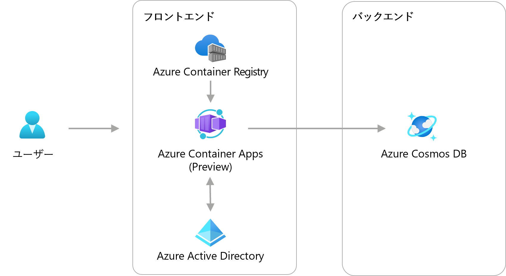
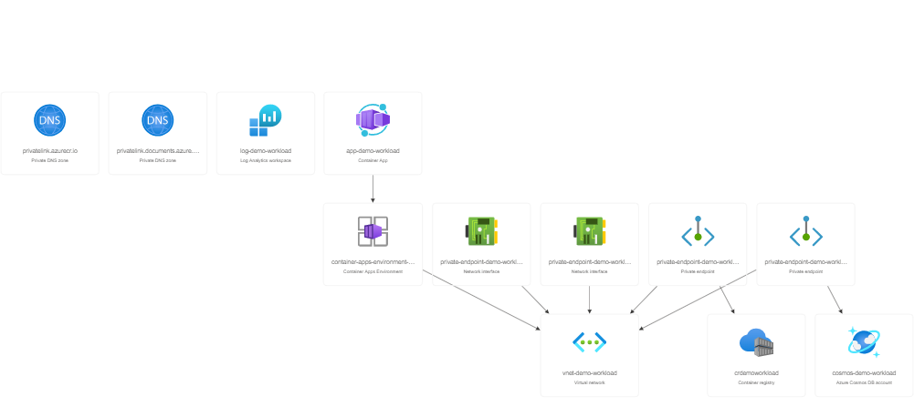
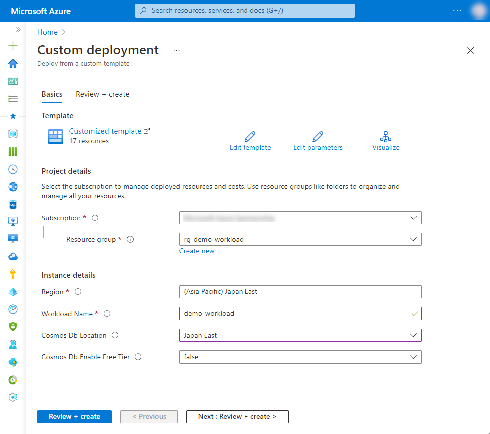

# 1-8 Firebase で作ったシステムを Azure に移行したい

Firebase の機能だけで構築されたスモールスタートの基盤を Azure に置き換えた際の構成例です。

新サービスである Azure Container Apps を使用することで、コンテナアプリケーションのデプロイと運用を簡素化します。


## 構成




### Azure リソース構成

- 共通
  - Azure Virtual Network
  - Azure Private DNS Zone
  - Azure Private Endpoint
- フロントエンド
  - Azure Container Apps
  - Azure Container Registry
- バックエンド
  - Azure Cosmos DB



本構成では、Azure Container Registry のアクセスは Virtual Network 内に閉じています。イメージを配置する場合は、こちらのドキュメントを参考に専用のエージェント プールを割り当てて操作するか、ネットワーク設定を適宜変更してください。

- [プライベート エンドポイントとプライベート レジストリを使用して az acr build を実行する](https://learn.microsoft.com/ja-jp/azure/container-registry/container-registry-private-link#execute-the-az-acr-build-with-private-endpoint-and-private-registry)

また、Azure AD は統合的なサービスなのでリソース作成は行いません。アプリケーションへ認証機構を導入するなどについては下記をご参照ください。

- [Microsoft ID プラットフォームのドキュメント - Microsoft Entra | Microsoft Docs](https://docs.microsoft.com/ja-jp/azure/active-directory/develop/)


## 利用方法

### リソースのデプロイ

下記の「Deploy to Azure」ボタンから開くと、Azure ポータルのデプロイ用のパラメータ入力画面に遷移します。

[](https://portal.azure.com/#create/Microsoft.Template/uri/https%3A%2F%2Fraw.githubusercontent.com%2Fquickstart-templates%2FAzure-for-startups%2Fmain%2F1_web-application%2F1-8_transfer-system-from-firebase%2Fazuredeploy.json)

各入力欄に適宜入力し、「Review + create」ボタンを選択します。パラメータの検証が正常に完了したら、「Create」ボタンを選択してデプロイを実行します。



| 項目 | 説明 |
|----|----|
| Project details | |
| Subscription | 利用するサブスクリプションを選択 |
| Resource Group | 利用する既存のグループを選択、または「Create new」から新規作成 |
| Instance details | |
| Region | 利用するリージョンを選択 |
| Workload Name | リソース名に付与する識別用の文字列（プロジェクト名など）を入力 |
| Cosmos Db Location | Azure Cosmos DB のリージョンを選択（※1） |
| Cosmos Db Enable Free Tier | Azure Cosmos DB の無料レベルを有効にするか選択 |

※1  現在、Azure Cosmos DB のリージョンが制限されており、リソースグループとは別にリージョンを選択できるようにしています。利用可能なリージョンについては、別途 Azure ポータルで Cosmos DB の作成画面を開き、リージョンの選択肢からご確認ください。


## デバッグ

本テンプレートをデバッグする場合は、ご参考ください。


### Azure CLI によるデプロイ

```bash
WORKLOAD_NAME="{string to identify your resources}"
RESOURCE_GROUP_NAME="rg-${WORKLOAD_NAME}"
LOCATION="{location that resources are deploy}"
az group create --name ${RESOURCE_GROUP_NAME} --location ${LOCATION}
az deployment group create --resource-group ${RESOURCE_GROUP_NAME} --template-file bicep/azuredeploy.bicep
```


### Bicep によるARMテンプレート生成

```bash
az bicep build --file bicep/azuredeploy.bicep --outdir .
```
