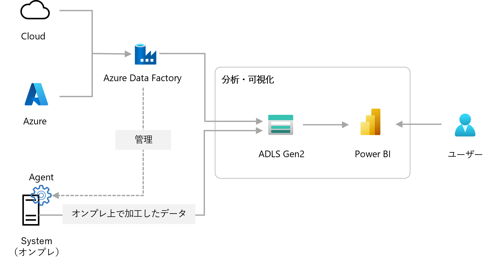
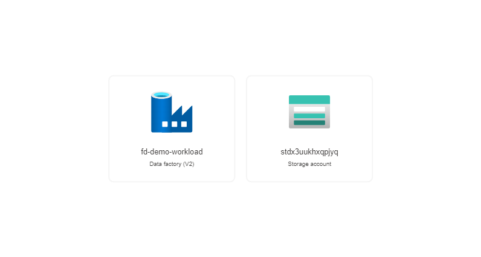
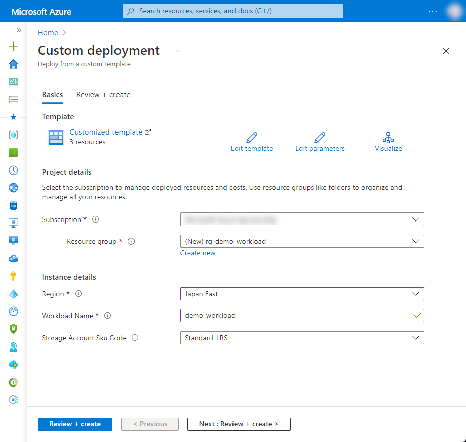

# 3-1 社内データを統合して分析・可視化したい

社内データを統合して分析/可視化したい際の構成例です。

Azure Data Factoryを利用することでAzureのみでなく、オンプレや他社クラウドのデータを統合することが可能です。
統合したデータをPower BIで可視化することで分析が可能です。


## 構成



Power BI による分析は、Power BI Desktop または Power BI サービスを利用できます。詳しくはドキュメントをご参照ください。

- [Power BI ドキュメント - Power BI | Microsoft Learn](https://learn.microsoft.com/ja-jp/power-bi/)

Power BI のデータソースとの接続については、こちらをご参照ください。

- [Power BI でデータに接続する ‐ ドキュメント - Power BI | Microsoft Learn](https://learn.microsoft.com/ja-jp/power-bi/connect-data/)

また、Azure Data Factory におけるオンプレ上のリソースとの接続については、セルフホステッド統合ランタイムについてご確認ください。

- [セルフホステッド統合ランタイム](https://learn.microsoft.com/en-us/azure/data-factory/concepts-integration-runtime#self-hosted-integration-runtime)


### Azure リソース構成

- Azure Data Factory
- Storage Account



Azure Data Factory では、Storage Account に対して Linked Service を構成しています。


## 利用方法

### リソースのデプロイ

下記の「Deploy to Azure」ボタンから開くと、Azure ポータルのデプロイ用のパラメータ入力画面に遷移します。

[](https://portal.azure.com/#create/Microsoft.Template/uri/https%3A%2F%2Fraw.githubusercontent.com%2Fquickstart-templates%2FAzure-for-startups%2Fmain%2F3_data-analysis-visialization%2F3-1_analyze-visualize-internal-data%2Fazuredeploy.json)

各入力欄に適宜入力し、「Review + create」ボタンを選択します。パラメータの検証が正常に完了したら、「Create」ボタンを選択してデプロイを実行します。



| 項目 | 説明 |
|----|----|
| Project details | |
| Subscription | 利用するサブスクリプションを選択 |
| Resource Group | 利用する既存のグループを選択、または「Create new」から新規作成 |
| Instance details | |
| Region | 利用するリージョンを選択 |
| Workload Name | リソース名に付与する識別用の文字列（プロジェクト名など）を入力 |
| Storage Account Sku Code | Azure Storage Account の SKU を選択 |


## デバッグ

本テンプレートをデバッグする場合は、ご参考ください。


### Azure CLI によるデプロイ

```bash
WORKLOAD_NAME="{string to identify your resources}"
RESOURCE_GROUP_NAME="rg-${WORKLOAD_NAME}"
LOCATION="{location that resources are deploy}"
az group create --name ${RESOURCE_GROUP_NAME} --location ${LOCATION}
az deployment group create --resource-group ${RESOURCE_GROUP_NAME} --template-file bicep/azuredeploy.bicep
```


### Bicep によるARMテンプレート生成

```bash
az bicep build --file bicep/azuredeploy.bicep --outdir .
```
