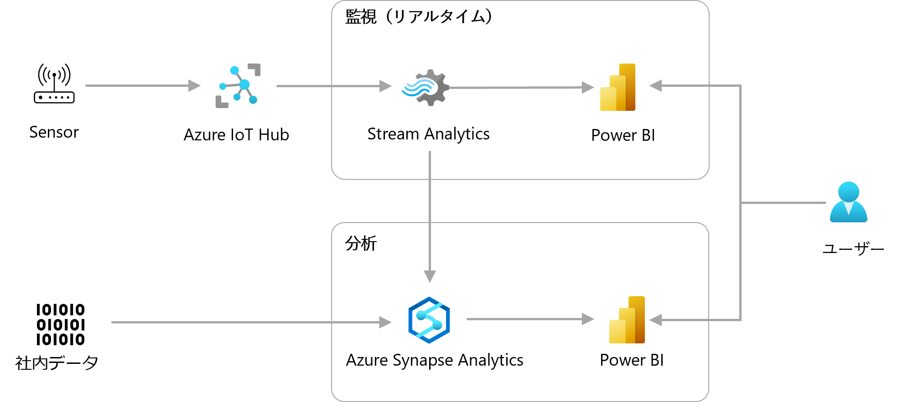
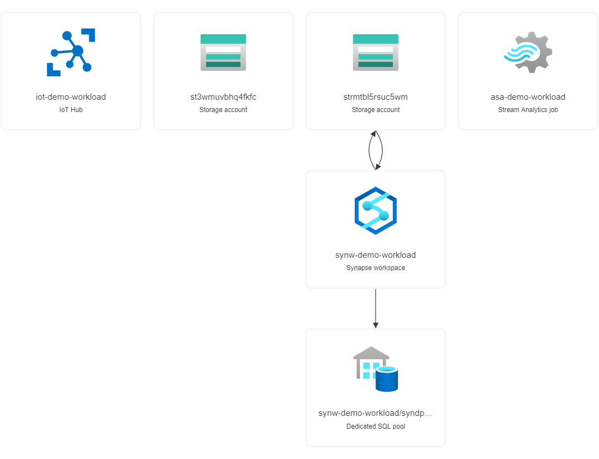
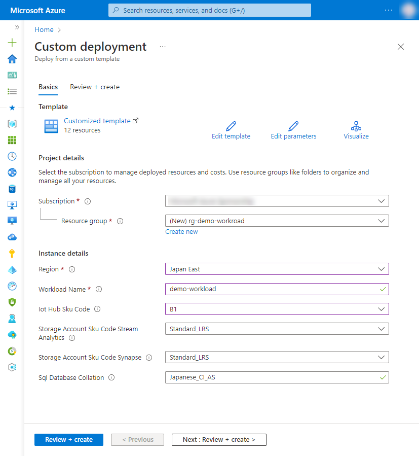

# 3-3 センサーデータをリアルタイムに分析したい

センサーから取得したデータをリアルタイム分析したい際の構成例です。

センサーデータをSteam Analyticsにてフィルター処理、並べ替え、集計、および結合を行い、センサーの状況などを可視化できます。Stream AnalyticsのデータをAzure Synapse Analyticsにも格納することで、社内データを合わせることが可能です。統合したデータをPower BIで可視化して、分析することが可能です。


## 構成



Power BI による分析は、Power BI サービス、Power BI Embedded または Power BI Desktop を利用できます。詳しくはドキュメントをご参照ください。

- [Power BI ドキュメント - Power BI | Microsoft Learn](https://learn.microsoft.com/ja-jp/power-bi/)
- [Power BI Embedded の分析ドキュメント - Power BI | Microsoft Learn](https://learn.microsoft.com/ja-jp/power-bi/developer/embedded/)

Power BI のデータソースとの接続については、こちらをご参照ください。

- [Power BI でデータに接続する ‐ ドキュメント - Power BI | Microsoft Learn](https://learn.microsoft.com/ja-jp/power-bi/connect-data/)


### Azure リソース構成

- Azure IoT Hub
- Azure Stream Analytics
- Azure Synapse Analytics




## 利用方法

### リソースのデプロイ

下記の「Deploy to Azure」ボタンから開くと、Azure ポータルのデプロイ用のパラメータ入力画面に遷移します。

[](https://portal.azure.com/#create/Microsoft.Template/uri/https%3A%2F%2Fraw.githubusercontent.com%2Fquickstart-templates%2FAzure-for-startups%2Fmain%2F3_data-analysis-visialization%2F3-3_realtime-analize-sensor-data%2Fazuredeploy.json)

各入力欄に適宜入力し、「Review + create」ボタンを選択します。パラメータの検証が正常に完了したら、「Create」ボタンを選択してデプロイを実行します。



| 項目 | 説明 |
|----|----|
| Project details | |
| Subscription | 利用するサブスクリプションを選択 |
| Resource Group | 利用する既存のグループを選択、または「Create new」から新規作成 |
| Instance details | |
| Region | 利用するリージョンを選択 |
| Workload Name | リソース名に付与する識別用の文字列（プロジェクト名など）を入力 |
| Iot Hub Sku Code | Azure IoT Hub のプランを選択 |
| Storage Account Sku Code Stream Analytics | Azure Stream Analytics 用の Azure Storage Account の SKU を選択（※1） |
| Storage Account Sku Code Synapse | Azure Synapse Analytics 用の Azure Storage Account の SKU を選択 |
| Sql Database Collation | Azure SQL Database の照合順序を選択（※2） |

※1 Azure Stream Analytics 用の Storage Account は、Azure Synapse Analytics への出力を利用する際に必要で、サポートされる SKU は Standard レベルのみです。詳しくは、こちらをご参照ください。

- [Azure Stream Analytics からの Azure Synapse Analytics 出力 | Microsoft Learn](https://learn.microsoft.com/ja-jp/azure/stream-analytics/azure-synapse-analytics-output)

※2 Azure SQL Server の照合順序については、こちらをご参照ください。

- [照合順序と Unicode のサポート - SQL Server | Microsoft Docs](https://docs.microsoft.com/ja-jp/sql/relational-databases/collations/collation-and-unicode-support?view=sql-server-ver16)


## リソース配置後の作業

### Azure Synapse Analytics へのアクセスについて

本構成のデプロイ直後は、Azure Synapse Analytics は外部からのアクセスを受け付けない設定になっています。

SQL pools の Built-in サーバーレス SQL プールの状態を Unreachable から直したい場合や、専用SQLプールへアクセスする場合は、Synapse Analytics のネットワーク設定から、作業環境のIPアドレスを許可するなど、適宜設定を行ってください。


### Azure Stream Analytics の Output の設定

デバイスからのメッセージデータの構造やデータベースの構造が利用者によって異なるため、本構成では、Azure Stream Analytics の Output の設定を行っていません。

下記ドキュメントを参考に、設定してご利用ください。

- [専用 SQL プールで Azure Stream Analytics を使用する - Azure Synapse Analytics | Microsoft Learn](https://learn.microsoft.com/ja-JP/azure/synapse-analytics/sql-data-warehouse/sql-data-warehouse-integrate-azure-stream-analytics)
- [マネージド ID を使用して Azure SQL Database または Azure Synapse Analytics にアクセスする - Azure Stream Analytics | Microsoft Learn](https://learn.microsoft.com/ja-jp/azure/stream-analytics/sql-database-output-managed-identity?tabs=azure-synapse)


### Azure IoT Hub へのデバイスの追加

Azure IoT Hub を利用するには、デバイスを登録する必要があります。下記を参考に進めてください。

- [チュートリアル - Azure IoT Hub へのデバイス接続を確認する | Microsoft Learn](https://learn.microsoft.com/ja-jp/azure/iot-hub/tutorial-connectivity)
- [クイックスタート - シミュレートされた対称キー デバイスを Microsoft Azure IoT Hub にプロビジョニングする | Microsoft Learn](https://learn.microsoft.com/ja-jp/azure/iot-dps/quick-create-simulated-device-symm-key?pivots=programming-language-ansi-c)


### (Optional) Azure Stream Analytics の開始

Azure Stream Analytics は、ジョブの開始を行うことで、データの移送を開始します。下記ドキュメントなどを参考にご利用ください。

- [Stream Analytics ジョブを開始して出力をチェックする - クイックスタート: Azure portal を使用して Stream Analytics ジョブを作成する | Microsoft Learn](https://learn.microsoft.com/ja-jp/azure/stream-analytics/stream-analytics-quick-create-portal)


## デバッグ

本テンプレートをデバッグする場合は、ご参考ください。


### Azure CLI によるデプロイ

```bash
WORKLOAD_NAME="{string to identify your resources}"
RESOURCE_GROUP_NAME="rg-${WORKLOAD_NAME}"
LOCATION="{location that resources are deploy}"
az group create --name ${RESOURCE_GROUP_NAME} --location ${LOCATION}
az deployment group create --resource-group ${RESOURCE_GROUP_NAME} --template-file bicep/azuredeploy.bicep
```


### Bicep によるARMテンプレート生成

```bash
az bicep build --file bicep/azuredeploy.bicep --outdir .
```
