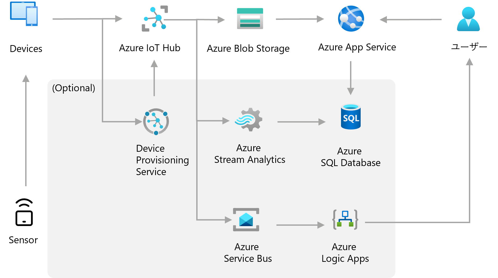
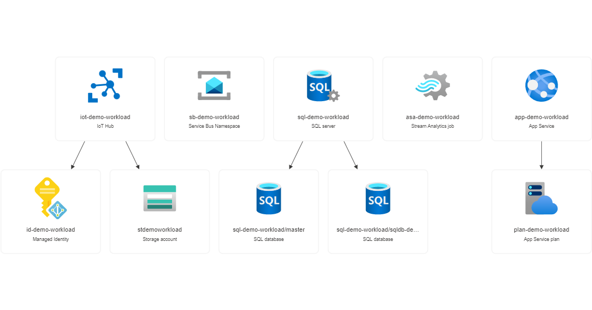
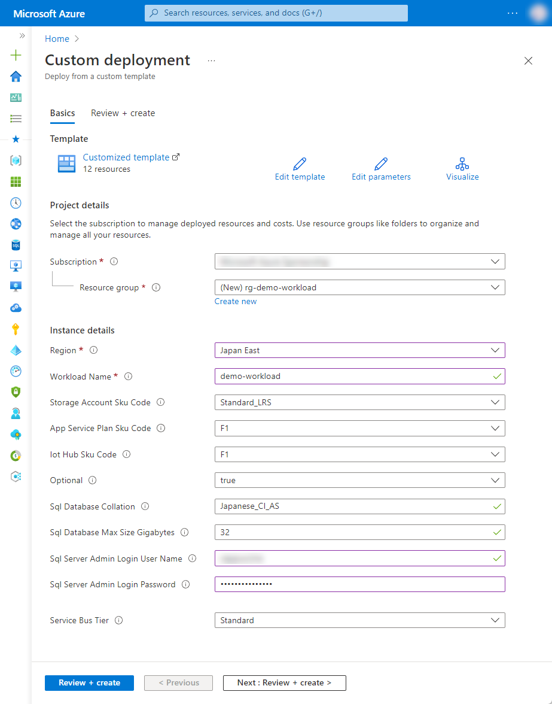

# 4-1 IoTデバイス or スマホからデータ取得・可視化（PaaS）

IoT デバイスからの テレメトリーを Azure IoT Hub で受けて保存、可視化を行います

(optional) デバイス登録の引き当てやデータベースへの保存、テレメトリに基づくアクションにはそれぞれ追加のサービスを利用し構築します


## 構成




### Azure リソース構成

- Azure IoT Hub
- Azure Storage Account
- Azure App Service (Web app)
- Azure Device Provisioning Service (DSP)
- Azure Stream Analytics
- Azure SQL Database
- Azure Service Bus
- Azure Logic App



Azure Device Provisioning Service (DSP) は、Azure IoT Hub とリンクが済んだ状態で配置されます。

Azure IoT Hub のルーティングは、以下のように構成しています。

- 組み込みのエンドポイントへのルーティング
- Azure Storage Account へのルーティング
- (Optional) Azure Service Bus Topic へのルーティング


## 利用方法

### リソースのデプロイ

下記の「Deploy to Azure」ボタンから開くと、Azure ポータルのデプロイ用のパラメータ入力画面に遷移します。

[](https://portal.azure.com/#create/Microsoft.Template/uri/https%3A%2F%2Fraw.githubusercontent.com%2Fquickstart-templates%2FAzure-for-startups%2Fmain%2F4_iot%2F4-1_collect-data-from-iot-mobile-devices-with-paas%2Fazuredeploy.json)

各入力欄に適宜入力し、「Review + create」ボタンを選択します。パラメータの検証が正常に完了したら、「Create」ボタンを選択してデプロイを実行します。



| 項目 | 説明 |
|----|----|
| Project details | |
| Subscription | 利用するサブスクリプションを選択 |
| Resource Group | 利用する既存のグループを選択、または「Create new」から新規作成 |
| Instance details | |
| Region | 利用するリージョンを選択 |
| Workload Name | リソース名に付与する識別用の文字列（プロジェクト名など）を入力 |
| Storage Account Sku Code | Azure Storage Account の SKU を選択 |
| App Service Plan Sku Code | Azure App Service Plan のプランを選択 |
| Iot Hub Sku Code | Azure IoT Hub のプランを選択 |
| Optional | Optional の構成を有効にするか選択 |
| Sql Database Collation | Optional の構成を含める場合、Azure SQL Database の照合順序を選択 |
| Sql Database Max Size Gigabytes | Optional の構成を含める場合、Azure SQL Database の最大サイズを入力（GB） |
| Sql Server Admin Login User Name | Optional の構成を含める場合、Azure SQL Server の管理者ユーザー名を入力 |
| Sql Server Admin Login Password | Optional の構成を含める場合、Azure SQL Server の管理者パスワードを入力 |
| Service Bus Tier | Optional の構成を含める場合、Azure Service Bus のティアを選択 |


## リソース配置後の作業

### Azure IoT Hub へのデバイスの追加

Azure IoT Hub を利用するには、デバイスを登録する必要があります。下記を参考に進めてください。

- [チュートリアル - Azure IoT Hub へのデバイス接続を確認する | Microsoft Learn](https://learn.microsoft.com/ja-jp/azure/iot-hub/tutorial-connectivity)
- [クイックスタート - シミュレートされた対称キー デバイスを Microsoft Azure IoT Hub にプロビジョニングする | Microsoft Learn](https://learn.microsoft.com/ja-jp/azure/iot-dps/quick-create-simulated-device-symm-key?pivots=programming-language-ansi-c)


### (Optional) Azure Service Bus トピックとサブスクリプションの設定

Azure Service Bus には、サンプルとして、トピック `fromiothub` を設定しています。下記を参考にトピックやサブスクリプションを設定してご利用ください。

- [Azure portal を使用して Service Bus のトピックとサブスクリプションを作成する - Azure Service Bus | Microsoft Learn](https://learn.microsoft.com/ja-jp/azure/service-bus-messaging/service-bus-quickstart-topics-subscriptions-portal)


### (Optional) Azure Stream Analytics の開始

Azure Stream Analytics は、ジョブの開始を行うことで、データの移送を開始します。下記ドキュメントなどを参考にご利用ください。

- [Stream Analytics ジョブを開始して出力をチェックする - クイックスタート: Azure portal を使用して Stream Analytics ジョブを作成する | Microsoft Learn](https://learn.microsoft.com/ja-jp/azure/stream-analytics/stream-analytics-quick-create-portal)


### (Optional) Azure SQL Database のテーブル作成

配置直後では Azure SQL Database にテーブルは作成されていません。Azure Stream Analytics からのデータを受け入れるためのテーブルを作成するには、下記ドキュメントを参考にテーブルを作成してください。

- [Azure Stream Analytics ジョブからAzure SQLデータベース テーブルへ書き込む | Microsoft Learn](https://learn.microsoft.com/ja-jp/azure/stream-analytics/sql-db-table)


## デバッグ

本テンプレートをデバッグする場合は、ご参考ください。


### Azure CLI によるデプロイ

```bash
WORKLOAD_NAME="{string to identify your resources}"
RESOURCE_GROUP_NAME="rg-${WORKLOAD_NAME}"
LOCATION="{location that resources are deploy}"
az group create --name ${RESOURCE_GROUP_NAME} --location ${LOCATION}
az deployment group create --resource-group ${RESOURCE_GROUP_NAME} --template-file bicep/azuredeploy.bicep
```


### Bicep によるARMテンプレート生成

```bash
az bicep build --file bicep/azuredeploy.bicep --outdir .
```
