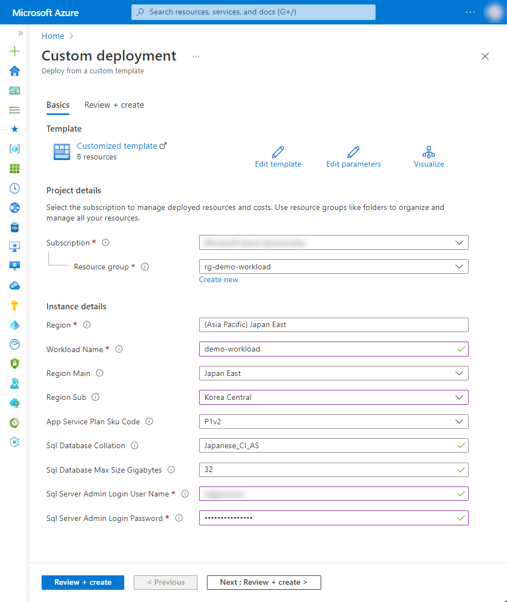

# 7-2 リージョン障害時も運用継続したい（Webアプリケーション編）

Web Applicationのマルチリージョン構成例となります。

Azure Front DoorにてメインリージョンのApp Serviceを監視しており、メインリージョンのApp Serviceが障害時に、サブリージョンのAppServiceへ自動でアクセスを切り替えます。リージョン障害時にも運用継続が可能となります。


## 構成


### Azure リソース構成

- Azure Front Door
- Azure App Service
- Azure SQL Database
- Azure Virtual Network


本構成では、リージョン障害時のアクセス切替えを Azure Front Door の正常性プローブによる監視のもと行います。

- [](https://learn.microsoft.com/ja-jp/azure/frontdoor/health-probes)

また、本構成では、Azure SQL Database の Geo replica を利用しています。サブリージョン側の App Service から SQL Database への接続については、例として Application settings に読取り専用レプリカに接続する場合の接続文字列を設定しています（具体的には、`ApplicationIntent` に `ReadOnly` を指定した接続文字列）。詳しくは下記ドキュメント等をご参考ください。

- [アクティブな地理的レプリケーション - Azure SQL Database | Microsoft Learn](https://learn.microsoft.com/ja-jp/azure/azure-sql/database/active-geo-replication-overview?view=azuresql)
- [レプリカでの読み取りクエリ - Azure SQL Database & SQL Managed Instance | Microsoft Learn](https://learn.microsoft.com/ja-jp/azure/azure-sql/database/read-scale-out)


## 利用方法

### リソースのデプロイ

下記の「Deploy to Azure」ボタンから開くと、Azure ポータルのデプロイ用のパラメータ入力画面に遷移します。

[](https://portal.azure.com/#create/Microsoft.Template/uri/https%3A%2F%2Fraw.githubusercontent.com%2Fquickstart-templates%2FAzure-for-startups%2Fmain%2F7_backup%2F7-2_disaster-recorvery-webapp%2Fazuredeploy.json)

各入力欄に適宜入力し、「Review + create」ボタンを選択します。パラメータの検証が正常に完了したら、「Create」ボタンを選択してデプロイを実行します。



| 項目 | 説明 |
|----|----|
| Project details | |
| Subscription | 利用するサブスクリプションを選択 |
| Resource Group | 利用する既存のグループを選択、または「Create new」から新規作成 |
| Instance details | |
| Region | 利用するリージョンを選択 |
| Workload Name | リソース名に付与する識別用の文字列（プロジェクト名など）を入力 |
| Region Main | メインリージョンを選択 |
| Region Sub | サブリージョンを選択 |
| App Service Plan Sku Name | Azure App Service Plan の SKU を選択 |
| Sql Database Collation | Azure SQL Database の照合順序を選択（※1） |
| Sql Database Max Size Gigabyes | Azure SQL Database の最大サイズを入力（GB） |
| Sql Server Admin Login User Name | Azure SQL Server の管理者ユーザー名を入力 |
| Sql Server Admin Login Password | Azure SQL Server の管理者ユーザーのパスワードを入力（※2） |

※1 Azure SQL Server の照合順序については、こちらをご参照ください。

- [照合順序と Unicode のサポート - SQL Server | Microsoft Docs](https://docs.microsoft.com/ja-jp/sql/relational-databases/collations/collation-and-unicode-support?view=sql-server-ver16)

※2 Azure SQL Server のパスワードについては、SQL Server のパスワードポリシーに従う必要があります。英数字記号を含む8文字以上の文字列を入力してください。詳細はこちらをご参照ください。

- [パスワード ポリシー - SQL Server | Microsoft Docs](https://docs.microsoft.com/ja-jp/sql/relational-databases/security/password-policy?view=sql-server-ver16)


## デバッグ

本テンプレートをデバッグする場合は、ご参考ください。


### Azure CLI によるデプロイ

```bash
WORKLOAD_NAME="{string to identify your resources}"
RESOURCE_GROUP_NAME="rg-${WORKLOAD_NAME}"
LOCATION="{location that resources are deploy}"
az group create --name ${RESOURCE_GROUP_NAME} --location ${LOCATION}
az deployment group create --resource-group ${RESOURCE_GROUP_NAME} --template-file bicep/azuredeploy.bicep
```


### Bicep によるARMテンプレート生成

```bash
az bicep build --file bicep/azuredeploy.bicep --outdir .
```


### サンプルアプリ

Azure Web App から SQL Database への疎通確認を行うため、[app](./app/) に簡単なサンプルアプリを用意しました。必要に応じてご参考ください。

