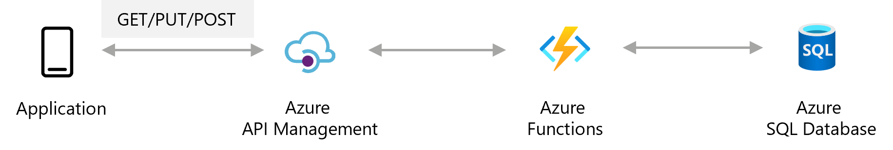
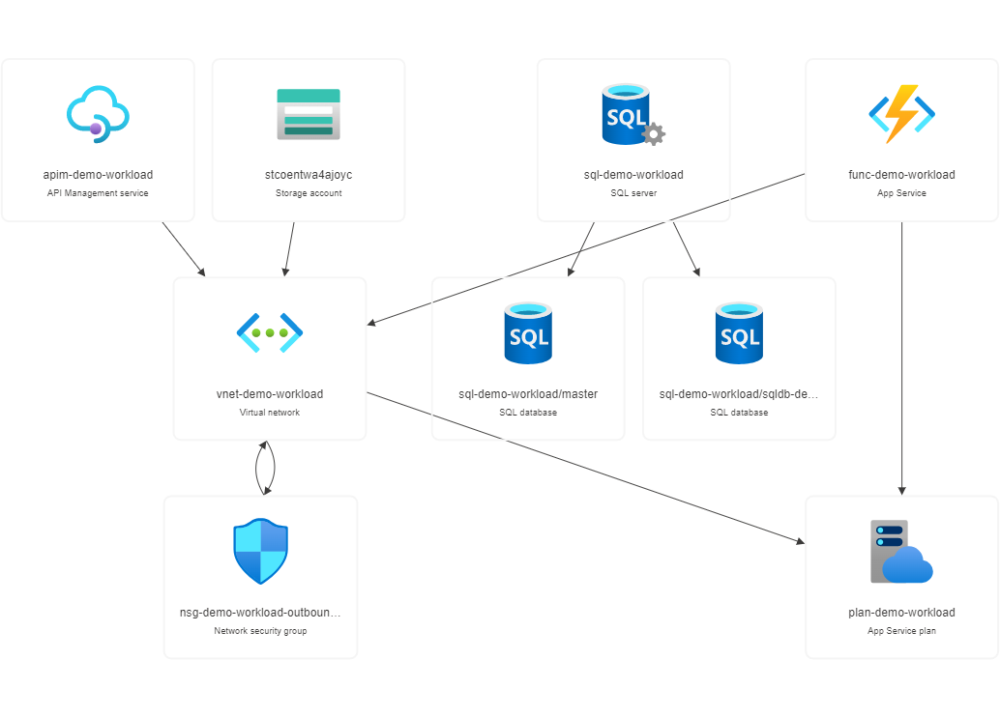
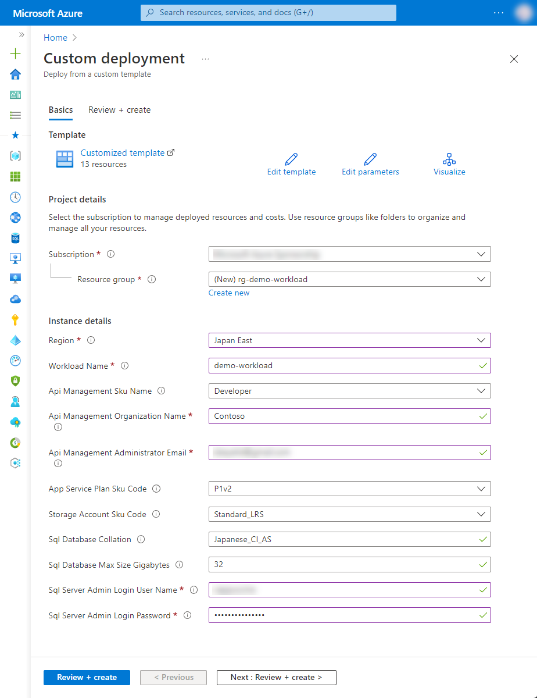

# 8-1 外部向けに API を公開したい

APIを外部公開したい際の構成例となります。Functions で作成したAPIをAPI Managementで管理します。

API Managementにてポータル提供（APIマニュアル）、課金管理、バージョン管理などAPI運用に必要な機能を備えており、API管理が容易になります。


## 構成




### Azure リソース構成

- Azure API Management
- Azure Functions
- Azure SQL Database
- Azure Virtual Network




## 利用方法

### リソースのデプロイ

下記の「Deploy to Azure」ボタンから開くと、Azure ポータルのデプロイ用のパラメータ入力画面に遷移します。

[](https://portal.azure.com/#create/Microsoft.Template/uri/https%3A%2F%2Fraw.githubusercontent.com%2Fquickstart-templates%2FAzure-for-startups%2Fmain%2F8_other%2F8-1_publish-api%2Fazuredeploy.json)

各入力欄に適宜入力し、「Review + create」ボタンを選択します。パラメータの検証が正常に完了したら、「Create」ボタンを選択してデプロイを実行します。



| 項目 | 説明 |
|----|----|
| Project details | |
| Subscription | 利用するサブスクリプションを選択 |
| Resource Group | 利用する既存のグループを選択、または「Create new」から新規作成 |
| Instance details | |
| Region | 利用するリージョンを選択 |
| Workload Name | リソース名に付与する識別用の文字列（プロジェクト名など）を入力 |
| Api Management Sku Name | Azure API Management の SKU 名を選択 |
| Api Management Organization Name | Azure API Management を管理する組織名を入力（※1） |
| Api Management Administrator Email | Azure API Management からの通知を受け取る管理者のメールアドレスを入力（※1） |
| App Service Plan Sku Code | Azure App Service Plan のプランを選択 |
| Storage Account Sku Code | Azure Storage Account の SKU を選択 |
| Sql Database Collation | Azure SQL Database の照合順序を選択（※2） |
| Sql Database Max Size Gigabyes | Azure SQL Database の最大サイズを入力（GB） |
| Sql Server Admin Login User Name | Azure SQL Server の管理者ユーザー名を入力 |
| Sql Server Admin Login Password | Azure SQL Server の管理者ユーザーのパスワードを入力（※3） |

※1 API Management を管理する組織名及び通知を受け取る管理者のメールアドレスについては、下記ドキュメントも併せてご参照ください。

- [クイック スタート - Azure API Management インスタンスの作成 | Microsoft Learn](https://learn.microsoft.com/ja-jp/azure/api-management/get-started-create-service-instance)

※2 Azure SQL Server の照合順序については、こちらをご参照ください。

- [照合順序と Unicode のサポート - SQL Server | Microsoft Docs](https://docs.microsoft.com/ja-jp/sql/relational-databases/collations/collation-and-unicode-support?view=sql-server-ver16)

※3 Azure SQL Server のパスワードについては、SQL Server のパスワードポリシーに従う必要があります。英数字記号を含む8文字以上の文字列を入力してください。詳細はこちらをご参照ください。

- [パスワード ポリシー - SQL Server | Microsoft Docs](https://docs.microsoft.com/ja-jp/sql/relational-databases/security/password-policy?view=sql-server-ver16)


## リソース配置後の作業

### Azure Functions に関数配置

Azure Functions は空の状態なので、任意の関数をデプロイしてください。Node.js による Azure Functions の実装については、下記などのドキュメントをご参考ください。

- [Visual Studio Code を使用して JavaScript 関数を作成する - Azure Functions | Microsoft Learn](https://learn.microsoft.com/ja-jp/azure/azure-functions/create-first-function-vs-code-node)
- [Azure Functions 用 JavaScript 開発者向けリファレンス | Microsoft Learn](https://learn.microsoft.com/ja-jp/azure/azure-functions/functions-reference-node)


### API Management で Azure Functions の関数を読込み

Azure Functions の関数の準備ができたら、API Management で Azure Functions の関数を読込みます。詳しくは下記ドキュメントなどをご参考ください。

- [Azure 関数アプリを API として API Management にインポートする - Azure API Management | Microsoft Learn](https://learn.microsoft.com/ja-jp/azure/api-management/import-function-app-as-api)

関数の読み込みが完了したら、ドキュメントに従い、Products の作成などAPIの公開に向けて作業を進めてください。

- [Azure API Management の概要と主な概念 | Microsoft Learn](https://learn.microsoft.com/ja-jp/azure/api-management/api-management-key-concepts)
- [チュートリアル - Azure API Management で製品を作成して発行する | Microsoft Learn](https://learn.microsoft.com/ja-jp/azure/api-management/api-management-howto-add-products?tabs=azure-portal)


## デバッグ

本テンプレートをデバッグする場合は、ご参考ください。


### Azure CLI によるデプロイ

```bash
WORKLOAD_NAME="{string to identify your resources}"
RESOURCE_GROUP_NAME="rg-${WORKLOAD_NAME}"
LOCATION="{location that resources are deploy}"
az group create --name ${RESOURCE_GROUP_NAME} --location ${LOCATION}
az deployment group create --resource-group ${RESOURCE_GROUP_NAME} --template-file bicep/azuredeploy.bicep
```


### Bicep によるARMテンプレート生成

```bash
az bicep build --file bicep/azuredeploy.bicep --outdir .
```


### Azure API Management の完全消去（ Purge ）

```bash
SUBSCRIPTION_ID="$(az account show --query id --output tsv | tr -d '\r')"
APIM_NAME=$(az apim list --resource-group ${RESOURCE_GROUP_NAME} --query [0].name --output tsv | tr -d '\r')
URL="https://management.azure.com/subscriptions/${SUBSCRIPTION_ID}/providers/Microsoft.ApiManagement/locations/japaneast/deletedservices/${APIM_NAME}?api-version=2021-08-01"
# management.azure.com に対するアクセストークンを取得する
TOKEN=$(az account get-access-token --resource=https://management.azure.com --query accessToken --output tsv | tr -d '\r')

curl -i -X DELETE -H "Authorization: Bearer ${TOKEN}" ${URL}
```
